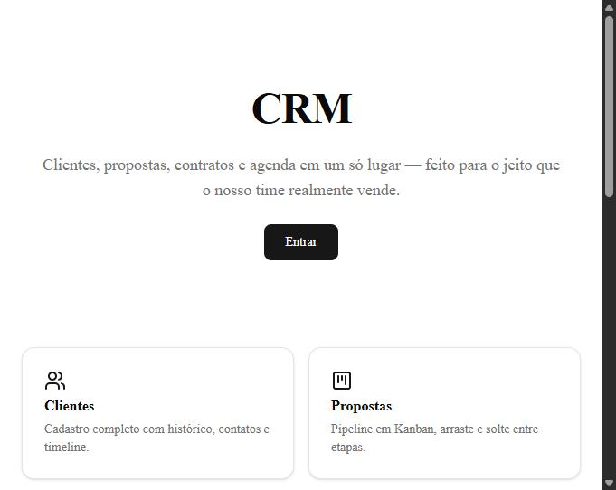

# CRM Interno (SaaS)

Workspace interno estilo Bitrix24 para pequenas empresas: clientes, propostas em Kanban, contratos e agenda em um só lugar.

🔗 **Deploy:** [crm-zeta-inky.vercel.app](https://crm-zeta-inky.vercel.app)

## O que faz

- **Clientes** — cadastro completo com histórico, contatos e timeline de atividades
- **Propostas** — pipeline em Kanban (drag & drop, ordenação por índice fracionário, update otimista)
- **Contratos** — arquivos (PDF/DOCX) com metadados e anotações
- **Agenda** — calendário interno de eventos
- **Dashboard** — visão geral com gráficos

Multi-tenant desde o início (`org_id` + RLS em todas as tabelas), pensado para eventualmente crescer para um workspace completo (Tarefas/Projetos, Drive, Automação, Chat — ver `ARQUITETURA-EXPANSAO.md`).

## Stack

Next.js 16 (App Router, React 19, TypeScript strict) · Supabase (Postgres + Auth + Storage + RLS) · Tailwind CSS v4 + shadcn/ui · TanStack Query v5 + TanStack Table v8 · react-hook-form + Zod · @dnd-kit · FullCalendar · Recharts · Vercel

## Status

Em desenvolvimento ativo. Módulos de Clientes, Propostas e Contratos implementados; Agenda e módulos de expansão em andamento.

Construído com apoio do [Claude Code](https://claude.com/claude-code) como par de programação.
